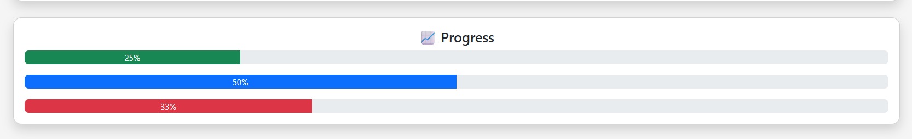

💪 Health Habit Tracker

A responsive web-based habit tracking application designed to monitor and analyze daily health activities.

🚀 Features

- Track daily water intake 💧
- Monitor exercise activity 🏋️
- Sleep tracking 😴
- Simple and clean UI
- Real-time updates

🛠️ Technologies Used

- HTML
- CSS (Bootstrap)
- JavaScript

🌐 Live Demo

👉 https://rashmiranjan-2005.github.io/Health-Habit-Tracker/

📸 Screenshot

📌 Author

- Rashmiranjan Das
